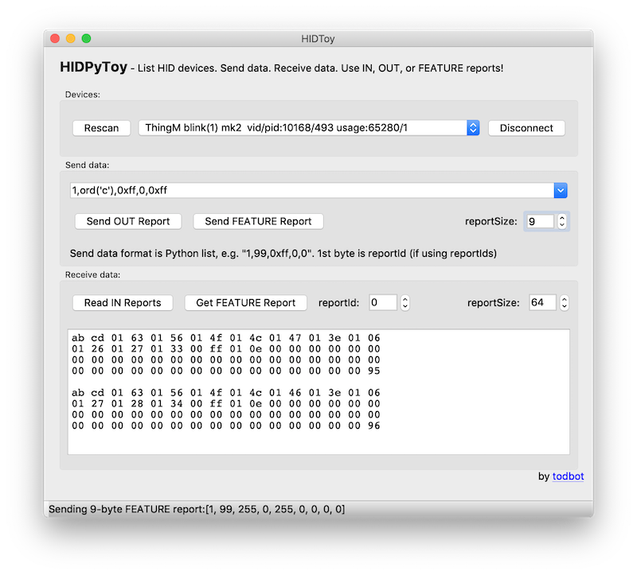

HIDPyToy - A simple tool to play with USB HID devices
====================



Written in Python3 with [PyQt5](https://build-system.fman.io/pyqt5-tutorial)
and built with [fbs](https://github.com/mherrmann/fbs-tutorial).

**Download**

Pre-build executables are available on the [hidpytoy releases page](https://github.com/todbot/hidpytoy/releases) for:

- [Mac OS X](https://github.com/todbot/hidpytoy/releases)
- [Windows x64](https://github.com/todbot/hidpytoy/releases)

This should work for Linux too but I've not yet tried.

**Development**

To install for development (until I get setup.py up):
```shell
git clone https://github.com/todbot/hidpytoy
cd hidpytoy

python3 -m venv venv
source venv/bin/activate

# on Windows powershell, and must be Python 3.6, not 3.7:
# py -3.6 -m venv venv
# .\venv\scripts\activate.ps1

pip install fbs
pip install PyQt5==5.9.2
pip install hidapi
# or equivalently
pip install fbs PyQt5==5.9.2 hidapi

# run the app
fbs run

# build the executable
fbs freeze

# To edit the UI
# 1. Install Qt Designer from https://build-system.fman.io/qt-designer-download
# 2. Save .UI file and run:
pyuic5 HIDToyWindow.ui -o HIDToyWindow.py

# or when working with it in another location:
cp ~/Desktop/HIDToyWindow.ui src/main/python/ && pyuic5 src/main/python/HIDToyWindow.ui -o src/main/python/HIDToyWindow.py
```

Be sure to see [fbs troubleshooting page](https://build-system.fman.io/troubleshooting)
