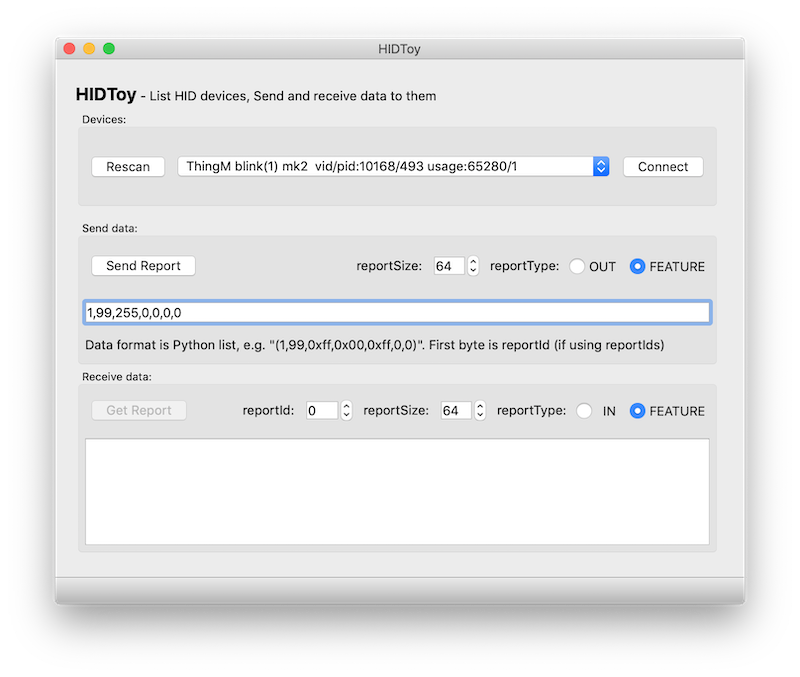

HIDPyToy
====================


A simple tool to play with USB HID devices.

Written in Python3, with [PyQt5](https://build-system.fman.io/pyqt5-tutorial)
and built with [fbs](https://github.com/mherrmann/fbs-tutorial).


To install for development:
```shell
git clone https://github.com/todbot/hidpytoy
cd hidpytoy

python3 -m venv venv
source venv/bin/activate

pip install fbs
pip install PyQt5==5.9.2
pip install hidapi

# run the app
fbs run

# build the executable
fbs freeze

# to edit the UI
# 1. Install Qt Designer from https://build-system.fman.io/qt-designer-download
# then save .UI file and run:
pyuic5 HIDToyWindow.ui -o HIDToyWindow.py

# or when working with it in another location:
cp ~/Desktop/HIDToyWindow.ui src/main/python/ && pyuic5 src/main/python/HIDToyWindow.ui -o src/main/python/HIDToyWindow.py 
```
