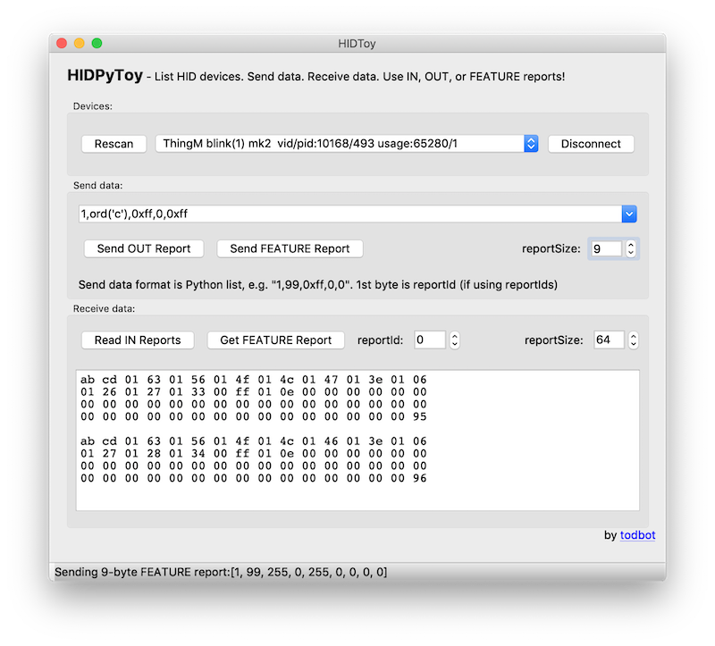

HIDPyToy - A simple tool to play with USB HID devices
====================


Written in Python 3 with [PySide6](https://doc.qt.io/qtforpython/) and packaged with [BeeWare/Briefcase](https://briefcase.readthedocs.io/).

**Download**

Pre-built executables are available on the [hidpytoy releases page](https://github.com/todbot/hidpytoy/releases) for:

- [macOS](https://github.com/todbot/hidpytoy/releases)
- [Windows x64](https://github.com/todbot/hidpytoy/releases)
- [Linux x64](https://github.com/todbot/hidpytoy/releases)

## Requirements

Python 3.9 or newer (3.11 or 3.12 recommended). Then:

```shell
git clone https://github.com/todbot/hidpytoy
cd hidpytoy
python3 -m venv venv
source venv/bin/activate        # Windows: venv\Scripts\activate
pip install -r requirements.txt
```

On **Linux**, HID device access typically requires either running as root or adding a udev rule:

```shell
# create /etc/udev/rules.d/99-hid.rules with:
SUBSYSTEM=="hidraw", MODE="0666"
# then reload:
sudo udevadm control --reload-rules && sudo udevadm trigger
```

## Running

```shell
source venv/bin/activate        # Windows: venv\Scripts\activate
make run
# or directly:
briefcase dev
```

## Building a standalone executable

Install the dev dependencies (includes Briefcase):

```shell
pip install -r requirements-dev.txt
```

Then build for your current platform:

```shell
make build-mac      # produces build/HIDPyToy/macos/
make build-win      # produces build/HIDPyToy/windows/
make build-linux    # produces build/HIDPyToy/linux/
```

Cross-compilation is not supported — build each platform on its native OS.

## Codesigning

See [codesigning.md](codesigning.md) for macOS notarization and Windows Azure Trusted Signing setup and instructions.

To build + sign + notarize + package as DMG (macOS):

```shell
make package-mac
```

## UI Customization

Edit `src/hidpytoy/HIDToyWindow.ui` in [Qt Designer](https://doc.qt.io/qt-6/qtdesigner-manual.html), then regenerate the Python class:

```shell
make regen-ui
# or directly:
pyside6-uic src/hidpytoy/HIDToyWindow.ui -o src/hidpytoy/HIDToyWindow.py
```

Do not edit `HIDToyWindow.py` by hand — it is overwritten on each regeneration.
